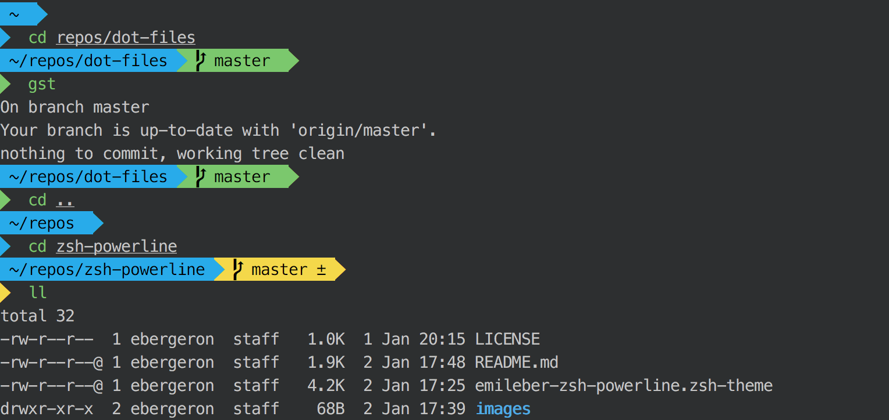

# zsh-powerline

My personal fork of agnoster zsh theme.

- Prompt on a new line
- Python virtualenv
- Git
- Unicode-compatible fonts and terminals (I use iTerm2 + Menlo)

For Mac users, I highly recommend iTerm 2 + Solarized Dark

# Installation

The theme is named `emileber-zsh-powerline` so it won't replace an existing theme, unless you already have mine installed.

1. Make a symbolic of the `.zsh-theme` file.

    ```
ln -s ~/path-to/zsh-powerline/emileber-zsh-powerline.zsh-theme ~/.oh-my-zsh/themes/emileber-zsh-powerline.zsh-theme
    ```

1. Set the `ZSH_THEME` variable in the `.zshrc` to

    ```
ZSH_THEME="emileber-zsh-powerline"
    ```

# Compatibility

**NOTE:** In all likelihood, you will need to install a [Powerline-patched font](https://github.com/Lokaltog/powerline-fonts) for this theme to render correctly.

To test if your terminal and font support it, check that all the necessary characters are supported by copying the following command to your terminal: `echo "\ue0b0 \u00b1 \ue0a0 \u27a6 \u2718 \u26a1 \u2699"`. The result should look like this:


## What does it show?

- If the previous command failed (✘)
- User @ Hostname (if user is not `DEFAULT_USER`, which can then be set in your profile)
- Git status
  - Branch () or detached head (➦)
  - Current branch / SHA1 in detached head state
  - Dirty working directory (±, color change)
- Working directory
- Elevated (root) privileges (⚡)


